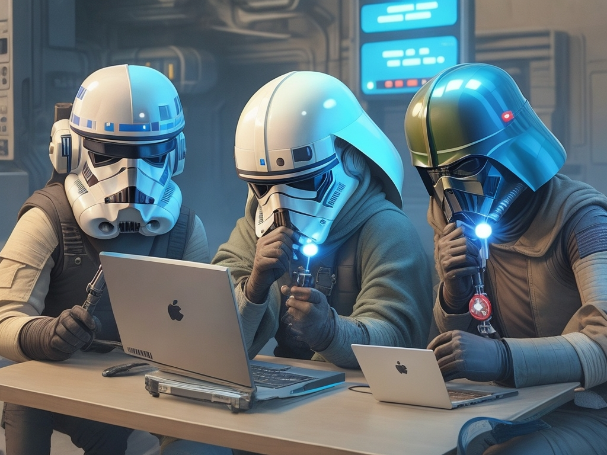
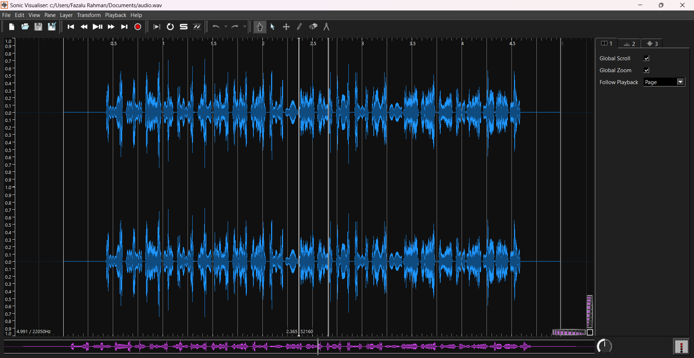
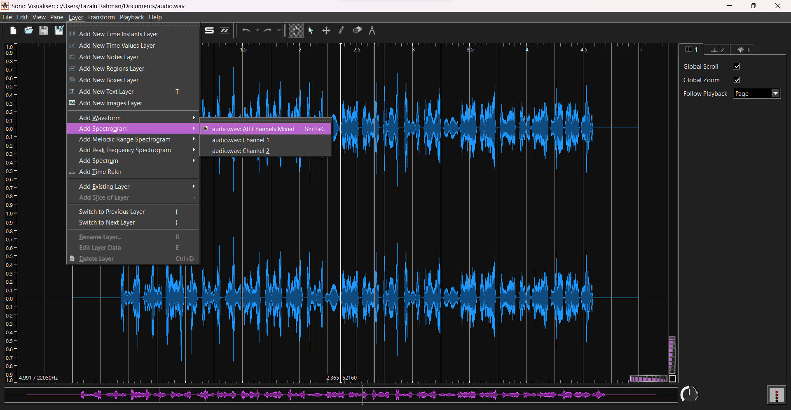
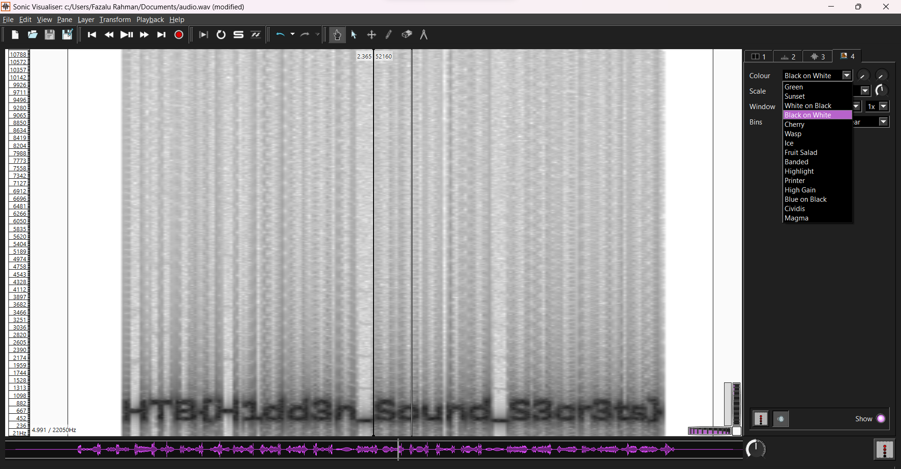

    	The Mandalorian's Audio Hunter

​		17th August 2023

​		Challenge Author(s): 
  Fazalu Rahman

​		

 

### Description:

In a distant galaxy, Mandalorian warrior Fazalu embarks on a vital mission to protect Mandalore from the Dark Side's looming threat. During his journey to the outer galaxy, Fazalu encounters a peculiar and dangerous wave sound from space. Determined to uncover the Dark Side's secrets hidden within the audio, he delves into the enigmatic sonic spectrum, decoding its steganographic puzzles. As Fazalu navigates the perilous soundscape, his expertise and alliances become crucial in unmasking the malevolent plot.May the Force guide your path to victory!

### Objective

Find the flag from the wav file

### Difficulty:

`easy`

### Flag:

`HTB{H1dd3n_Sound_S3cr3ts}`

# Challenge
I created a CTF challenge by converting a flag image into a WAV audio file. First, I created the flag image. This could be any image, but for this challenge, I used an image of the CTF logo. Then, I used the coagula tool to convert the image into a WAV audio file. Finally, I saved the WAV audio file

# Solver
Step 1.
First Download the .zip file that consist the .wav file 

Step 2.
Open Sonic Visualizer app and open the wav file from the zip file that you have downloaded 

Step 3.
Go to Layer > Add Spectrogram > All Channel Mixed 

Step 4.
Go to Colour and make that to : White on Black
 

You can see the flag below now May the force be with you : ) 

